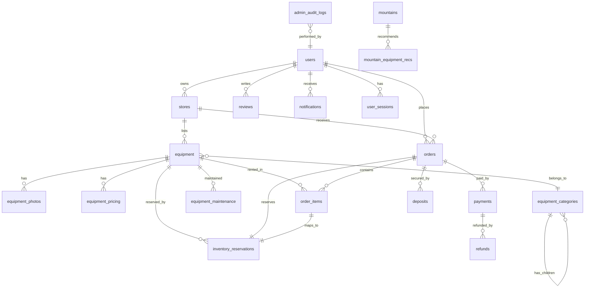

# Database Schema — Outdoor Equipment Rental Marketplace

## Rental Inventory Reservation Engine

---

## ERD (Entity Relationship Diagram)



---

## Table List

| # | Table | Module | Purpose |
|---|-------|--------|---------|
| 1 | `users` | Auth | All platform users (renters, owners, admins) |
| 2 | `user_sessions` | Auth | Refresh tokens & session tracking |
| 3 | `password_resets` | Auth | Password reset tokens |
| 4 | `stores` | Store | Rental store profiles |
| 5 | `store_documents` | Store | KYC/verification documents |
| 6 | `equipment_categories` | Equipment | Hierarchical categories |
| 7 | `equipment` | Equipment | Equipment master data + total stock |
| 8 | `equipment_photos` | Equipment | Gallery images |
| 9 | `equipment_pricing` | Equipment | Pricing tiers (daily, weekly, custom) |
| 10 | `equipment_maintenance` | Inventory | Scheduled maintenance blocking stock |
| 11 | `inventory_reservations` | Inventory | **Core reservation engine table** |
| 12 | `reservation_date_locks` | Inventory | Per-date quantity locks for fast availability |
| 13 | `orders` | Order | Order headers |
| 14 | `order_items` | Order | Line items with date ranges |
| 15 | `order_status_history` | Order | State machine audit trail |
| 16 | `payments` | Payment | Payment transactions (Midtrans) |
| 17 | `deposits` | Payment | Security deposits |
| 18 | `refunds` | Payment | Refund records |
| 19 | `reviews` | Review | Post-rental reviews |
| 20 | `notifications` | Notification | User notifications |
| 21 | `mountains` | Recommendation | Mountain data |
| 22 | `mountain_equipment_recs` | Recommendation | Equipment recommendations per mountain |
| 23 | `admin_audit_logs` | Admin | Admin action audit trail |

---

## Table Definitions

### 1. `users`

| Column | Type | Constraints |
|--------|------|-------------|
| `id` | `CHAR(36)` | PK, UUID |
| `email` | `VARCHAR(255)` | UNIQUE, NOT NULL |
| `password_hash` | `VARCHAR(255)` | NOT NULL |
| `full_name` | `VARCHAR(100)` | NOT NULL |
| `phone` | `VARCHAR(20)` | NULLABLE |
| `avatar_url` | `VARCHAR(500)` | NULLABLE |
| `role` | `ENUM('renter','owner','admin')` | NOT NULL, DEFAULT 'renter' |
| `email_verified_at` | `TIMESTAMP` | NULLABLE |
| `is_active` | `TINYINT(1)` | DEFAULT 1 |
| `created_at` | `TIMESTAMP` | NOT NULL, DEFAULT CURRENT_TIMESTAMP |
| `updated_at` | `TIMESTAMP` | NOT NULL, ON UPDATE CURRENT_TIMESTAMP |
| `deleted_at` | `TIMESTAMP` | NULLABLE (soft delete) |

**Indexes:**
- `idx_users_email` → UNIQUE on `email` WHERE `deleted_at IS NULL`
- `idx_users_role` → on `role`
- `idx_users_deleted_at` → on `deleted_at`

---

### 2. `user_sessions`

| Column | Type | Constraints |
|--------|------|-------------|
| `id` | `CHAR(36)` | PK, UUID |
| `user_id` | `CHAR(36)` | FK → users.id, NOT NULL |
| `refresh_token_hash` | `VARCHAR(255)` | NOT NULL |
| `user_agent` | `VARCHAR(500)` | NULLABLE |
| `ip_address` | `VARCHAR(45)` | NULLABLE |
| `expires_at` | `TIMESTAMP` | NOT NULL |
| `revoked_at` | `TIMESTAMP` | NULLABLE |
| `created_at` | `TIMESTAMP` | NOT NULL |

**Indexes:**
- `idx_sessions_user_id` → on `user_id`
- `idx_sessions_expires_at` → on `expires_at`

---

### 3. `password_resets`

| Column | Type | Constraints |
|--------|------|-------------|
| `id` | `CHAR(36)` | PK, UUID |
| `user_id` | `CHAR(36)` | FK → users.id, NOT NULL |
| `token_hash` | `VARCHAR(255)` | NOT NULL |
| `expires_at` | `TIMESTAMP` | NOT NULL |
| `used_at` | `TIMESTAMP` | NULLABLE |
| `created_at` | `TIMESTAMP` | NOT NULL |

---

### 4. `stores`

| Column | Type | Constraints |
|--------|------|-------------|
| `id` | `CHAR(36)` | PK, UUID |
| `owner_id` | `CHAR(36)` | FK → users.id, NOT NULL |
| `name` | `VARCHAR(100)` | NOT NULL |
| `slug` | `VARCHAR(120)` | UNIQUE, NOT NULL |
| `description` | `TEXT` | NULLABLE |
| `phone` | `VARCHAR(20)` | NOT NULL |
| `email` | `VARCHAR(255)` | NOT NULL |
| `address` | `TEXT` | NOT NULL |
| `city` | `VARCHAR(100)` | NOT NULL |
| `province` | `VARCHAR(100)` | NOT NULL |
| `postal_code` | `VARCHAR(10)` | NULLABLE |
| `latitude` | `DECIMAL(10,8)` | NULLABLE |
| `longitude` | `DECIMAL(11,8)` | NULLABLE |
| `logo_url` | `VARCHAR(500)` | NULLABLE |
| `banner_url` | `VARCHAR(500)` | NULLABLE |
| `status` | `ENUM('pending','verified','suspended','rejected')` | DEFAULT 'pending' |
| `verified_at` | `TIMESTAMP` | NULLABLE |
| `rating_avg` | `DECIMAL(3,2)` | DEFAULT 0.00 |
| `rating_count` | `INT UNSIGNED` | DEFAULT 0 |
| `created_at` | `TIMESTAMP` | NOT NULL |
| `updated_at` | `TIMESTAMP` | NOT NULL |
| `deleted_at` | `TIMESTAMP` | NULLABLE |

**Indexes:**
- `idx_stores_owner_id` → on `owner_id`
- `idx_stores_slug` → UNIQUE on `slug`
- `idx_stores_status` → on `status`
- `idx_stores_city` → on `city`
- `idx_stores_location` → on `latitude, longitude`

---

### 5. `store_documents`

| Column | Type | Constraints |
|--------|------|-------------|
| `id` | `CHAR(36)` | PK, UUID |
| `store_id` | `CHAR(36)` | FK → stores.id, NOT NULL |
| `document_type` | `ENUM('ktp','npwp','siu','other')` | NOT NULL |
| `document_url` | `VARCHAR(500)` | NOT NULL |
| `verified_at` | `TIMESTAMP` | NULLABLE |
| `rejected_reason` | `VARCHAR(500)` | NULLABLE |
| `created_at` | `TIMESTAMP` | NOT NULL |

---

### 6. `equipment_categories`

| Column | Type | Constraints |
|--------|------|-------------|
| `id` | `CHAR(36)` | PK, UUID |
| `parent_id` | `CHAR(36)` | FK → self, NULLABLE |
| `name` | `VARCHAR(100)` | NOT NULL |
| `slug` | `VARCHAR(120)` | UNIQUE, NOT NULL |
| `icon_url` | `VARCHAR(500)` | NULLABLE |
| `sort_order` | `INT` | DEFAULT 0 |
| `is_active` | `TINYINT(1)` | DEFAULT 1 |
| `created_at` | `TIMESTAMP` | NOT NULL |
| `updated_at` | `TIMESTAMP` | NOT NULL |
| `deleted_at` | `TIMESTAMP` | NULLABLE |

**Indexes:**
- `idx_categories_parent_id` → on `parent_id`
- `idx_categories_slug` → UNIQUE on `slug`

---

### 7. `equipment`

| Column | Type | Constraints |
|--------|------|-------------|
| `id` | `CHAR(36)` | PK, UUID |
| `store_id` | `CHAR(36)` | FK → stores.id, NOT NULL |
| `category_id` | `CHAR(36)` | FK → equipment_categories.id, NOT NULL |
| `name` | `VARCHAR(200)` | NOT NULL |
| `slug` | `VARCHAR(220)` | NOT NULL |
| `description` | `TEXT` | NULLABLE |
| `brand` | `VARCHAR(100)` | NULLABLE |
| `specifications` | `JSON` | NULLABLE |
| `total_stock` | `INT UNSIGNED` | NOT NULL, DEFAULT 0 |
| `condition` | `ENUM('new','good','fair','worn')` | DEFAULT 'good' |
| `weight_grams` | `INT UNSIGNED` | NULLABLE |
| `min_rental_days` | `INT UNSIGNED` | DEFAULT 1 |
| `max_rental_days` | `INT UNSIGNED` | DEFAULT 30 |
| `requires_deposit` | `TINYINT(1)` | DEFAULT 1 |
| `deposit_amount` | `DECIMAL(12,2)` | DEFAULT 0.00 |
| `is_active` | `TINYINT(1)` | DEFAULT 1 |
| `rating_avg` | `DECIMAL(3,2)` | DEFAULT 0.00 |
| `rating_count` | `INT UNSIGNED` | DEFAULT 0 |
| `rental_count` | `INT UNSIGNED` | DEFAULT 0 |
| `created_at` | `TIMESTAMP` | NOT NULL |
| `updated_at` | `TIMESTAMP` | NOT NULL |
| `deleted_at` | `TIMESTAMP` | NULLABLE |

**Indexes:**
- `idx_equipment_store_id` → on `store_id`
- `idx_equipment_category_id` → on `category_id`
- `idx_equipment_slug` → on `store_id, slug` (UNIQUE per store)
- `idx_equipment_active` → on `is_active, deleted_at`
- `idx_equipment_stock` → on `total_stock` (for availability filter)

---

### 8. `equipment_photos`

| Column | Type | Constraints |
|--------|------|-------------|
| `id` | `CHAR(36)` | PK, UUID |
| `equipment_id` | `CHAR(36)` | FK → equipment.id, NOT NULL |
| `photo_url` | `VARCHAR(500)` | NOT NULL |
| `thumbnail_url` | `VARCHAR(500)` | NULLABLE |
| `sort_order` | `INT` | DEFAULT 0 |
| `is_primary` | `TINYINT(1)` | DEFAULT 0 |
| `created_at` | `TIMESTAMP` | NOT NULL |

**Indexes:**
- `idx_photos_equipment_id` → on `equipment_id, sort_order`

---

### 9. `equipment_pricing`

| Column | Type | Constraints |
|--------|------|-------------|
| `id` | `CHAR(36)` | PK, UUID |
| `equipment_id` | `CHAR(36)` | FK → equipment.id, NOT NULL |
| `pricing_type` | `ENUM('daily','weekly','monthly','custom')` | NOT NULL |
| `min_days` | `INT UNSIGNED` | NOT NULL, DEFAULT 1 |
| `max_days` | `INT UNSIGNED` | NULLABLE |
| `price_per_day` | `DECIMAL(12,2)` | NOT NULL |
| `is_active` | `TINYINT(1)` | DEFAULT 1 |
| `created_at` | `TIMESTAMP` | NOT NULL |
| `updated_at` | `TIMESTAMP` | NOT NULL |

**Indexes:**
- `idx_pricing_equipment_id` → on `equipment_id, is_active`
- `idx_pricing_type` → on `equipment_id, pricing_type`

---

### 10. `equipment_maintenance`

Blocks stock from availability for maintenance/repair periods.

| Column | Type | Constraints |
|--------|------|-------------|
| `id` | `CHAR(36)` | PK, UUID |
| `equipment_id` | `CHAR(36)` | FK → equipment.id, NOT NULL |
| `quantity` | `INT UNSIGNED` | NOT NULL |
| `start_date` | `DATE` | NOT NULL |
| `end_date` | `DATE` | NOT NULL |
| `reason` | `VARCHAR(500)` | NULLABLE |
| `created_by` | `CHAR(36)` | FK → users.id, NOT NULL |
| `created_at` | `TIMESTAMP` | NOT NULL |
| `updated_at` | `TIMESTAMP` | NOT NULL |

**Indexes:**
- `idx_maintenance_equipment_dates` → on `equipment_id, start_date, end_date`
- `idx_maintenance_daterange` → on `start_date, end_date, equipment_id`

---

### 11. `inventory_reservations` ⭐ (Core Reservation Engine)

This is the central table that powers the date-range based availability system.

| Column | Type | Constraints |
|--------|------|-------------|
| `id` | `CHAR(36)` | PK, UUID |
| `equipment_id` | `CHAR(36)` | FK → equipment.id, NOT NULL |
| `order_item_id` | `CHAR(36)` | FK → order_items.id, NULLABLE |
| `quantity` | `INT UNSIGNED` | NOT NULL |
| `start_date` | `DATE` | NOT NULL |
| `end_date` | `DATE` | NOT NULL |
| `status` | `ENUM('pending_payment','confirmed','active','completed','cancelled','expired')` | NOT NULL |
| `expires_at` | `TIMESTAMP` | NULLABLE (for pending_payment TTL) |
| `confirmed_at` | `TIMESTAMP` | NULLABLE |
| `activated_at` | `TIMESTAMP` | NULLABLE |
| `completed_at` | `TIMESTAMP` | NULLABLE |
| `cancelled_at` | `TIMESTAMP` | NULLABLE |
| `cancellation_reason` | `VARCHAR(500)` | NULLABLE |
| `created_at` | `TIMESTAMP` | NOT NULL |
| `updated_at` | `TIMESTAMP` | NOT NULL |

**Indexes:**
- `idx_reservations_equipment_status_dates` → on `equipment_id, status, start_date, end_date` **(PRIMARY LOOKUP)**
- `idx_reservations_equipment_dates` → on `equipment_id, start_date, end_date`
- `idx_reservations_status_expires` → on `status, expires_at` (for expiration job)
- `idx_reservations_order_item` → on `order_item_id`

**CHECK Constraint:**
- `end_date >= start_date`
- `quantity > 0`

---

### 12. `reservation_date_locks`

Denormalized per-date quantity locks for **fast O(1) availability lookups** without scanning all overlapping reservations. Maintained transactionally alongside `inventory_reservations`.

| Column | Type | Constraints |
|--------|------|-------------|
| `id` | `BIGINT UNSIGNED` | PK, AUTO_INCREMENT |
| `equipment_id` | `CHAR(36)` | FK → equipment.id, NOT NULL |
| `lock_date` | `DATE` | NOT NULL |
| `reserved_qty` | `INT UNSIGNED` | NOT NULL, DEFAULT 0 |
| `maintenance_qty` | `INT UNSIGNED` | NOT NULL, DEFAULT 0 |
| `reservation_id` | `CHAR(36)` | FK → inventory_reservations.id, NULLABLE |
| `maintenance_id` | `CHAR(36)` | FK → equipment_maintenance.id, NULLABLE |
| `created_at` | `TIMESTAMP` | NOT NULL |

**Indexes:**
- `uidx_date_locks_equip_date` → UNIQUE on `equipment_id, lock_date, reservation_id, maintenance_id`
- `idx_date_locks_availability` → on `equipment_id, lock_date` **(AVAILABILITY QUERY)**

**Aggregation View:**
```sql
-- Fast availability check for a date
SELECT lock_date,
       SUM(reserved_qty) + SUM(maintenance_qty) AS total_locked
FROM reservation_date_locks
WHERE equipment_id = ?
  AND lock_date BETWEEN ? AND ?
GROUP BY lock_date
```

---

### 13. `orders`

| Column | Type | Constraints |
|--------|------|-------------|
| `id` | `CHAR(36)` | PK, UUID |
| `order_number` | `VARCHAR(20)` | UNIQUE, NOT NULL |
| `renter_id` | `CHAR(36)` | FK → users.id, NOT NULL |
| `store_id` | `CHAR(36)` | FK → stores.id, NOT NULL |
| `status` | `ENUM('pending_payment','paid','approved','rejected','active','completed','cancelled','expired')` | NOT NULL |
| `rental_start_date` | `DATE` | NOT NULL |
| `rental_end_date` | `DATE` | NOT NULL |
| `rental_days` | `INT UNSIGNED` | NOT NULL |
| `subtotal` | `DECIMAL(12,2)` | NOT NULL |
| `service_fee` | `DECIMAL(12,2)` | DEFAULT 0.00 |
| `deposit_total` | `DECIMAL(12,2)` | DEFAULT 0.00 |
| `total_amount` | `DECIMAL(12,2)` | NOT NULL |
| `notes` | `TEXT` | NULLABLE |
| `pickup_method` | `ENUM('pickup','delivery')` | DEFAULT 'pickup' |
| `delivery_address` | `TEXT` | NULLABLE |
| `payment_deadline` | `TIMESTAMP` | NOT NULL |
| `approved_at` | `TIMESTAMP` | NULLABLE |
| `rejected_at` | `TIMESTAMP` | NULLABLE |
| `rejection_reason` | `VARCHAR(500)` | NULLABLE |
| `completed_at` | `TIMESTAMP` | NULLABLE |
| `cancelled_at` | `TIMESTAMP` | NULLABLE |
| `created_at` | `TIMESTAMP` | NOT NULL |
| `updated_at` | `TIMESTAMP` | NOT NULL |
| `deleted_at` | `TIMESTAMP` | NULLABLE |

**Indexes:**
- `idx_orders_order_number` → UNIQUE on `order_number`
- `idx_orders_renter_id` → on `renter_id, status`
- `idx_orders_store_id` → on `store_id, status`
- `idx_orders_status` → on `status, payment_deadline`
- `idx_orders_dates` → on `rental_start_date, rental_end_date`

---

### 14. `order_items`

| Column | Type | Constraints |
|--------|------|-------------|
| `id` | `CHAR(36)` | PK, UUID |
| `order_id` | `CHAR(36)` | FK → orders.id, NOT NULL |
| `equipment_id` | `CHAR(36)` | FK → equipment.id, NOT NULL |
| `reservation_id` | `CHAR(36)` | FK → inventory_reservations.id, NOT NULL |
| `quantity` | `INT UNSIGNED` | NOT NULL |
| `price_per_day` | `DECIMAL(12,2)` | NOT NULL |
| `rental_days` | `INT UNSIGNED` | NOT NULL |
| `subtotal` | `DECIMAL(12,2)` | NOT NULL |
| `deposit_per_unit` | `DECIMAL(12,2)` | DEFAULT 0.00 |
| `deposit_subtotal` | `DECIMAL(12,2)` | DEFAULT 0.00 |
| `created_at` | `TIMESTAMP` | NOT NULL |
| `updated_at` | `TIMESTAMP` | NOT NULL |

**Indexes:**
- `idx_order_items_order_id` → on `order_id`
- `idx_order_items_equipment_id` → on `equipment_id`
- `idx_order_items_reservation_id` → UNIQUE on `reservation_id`

---

### 15. `order_status_history`

| Column | Type | Constraints |
|--------|------|-------------|
| `id` | `CHAR(36)` | PK, UUID |
| `order_id` | `CHAR(36)` | FK → orders.id, NOT NULL |
| `from_status` | `VARCHAR(30)` | NULLABLE |
| `to_status` | `VARCHAR(30)` | NOT NULL |
| `changed_by` | `CHAR(36)` | FK → users.id, NULLABLE |
| `reason` | `VARCHAR(500)` | NULLABLE |
| `metadata` | `JSON` | NULLABLE |
| `created_at` | `TIMESTAMP` | NOT NULL |

**Indexes:**
- `idx_status_history_order_id` → on `order_id, created_at`

---

### 16. `payments`

| Column | Type | Constraints |
|--------|------|-------------|
| `id` | `CHAR(36)` | PK, UUID |
| `order_id` | `CHAR(36)` | FK → orders.id, NOT NULL |
| `payment_type` | `ENUM('rental','deposit')` | NOT NULL |
| `amount` | `DECIMAL(12,2)` | NOT NULL |
| `method` | `VARCHAR(50)` | NULLABLE |
| `status` | `ENUM('pending','success','failed','expired','refunded')` | NOT NULL |
| `midtrans_transaction_id` | `VARCHAR(100)` | NULLABLE |
| `midtrans_order_id` | `VARCHAR(100)` | NULLABLE |
| `midtrans_snap_token` | `VARCHAR(255)` | NULLABLE |
| `midtrans_redirect_url` | `VARCHAR(500)` | NULLABLE |
| `midtrans_payment_type` | `VARCHAR(50)` | NULLABLE |
| `paid_at` | `TIMESTAMP` | NULLABLE |
| `expired_at` | `TIMESTAMP` | NULLABLE |
| `raw_callback` | `JSON` | NULLABLE |
| `created_at` | `TIMESTAMP` | NOT NULL |
| `updated_at` | `TIMESTAMP` | NOT NULL |

**Indexes:**
- `idx_payments_order_id` → on `order_id, payment_type`
- `idx_payments_midtrans_order` → on `midtrans_order_id`
- `idx_payments_status` → on `status`

---

### 17. `deposits`

| Column | Type | Constraints |
|--------|------|-------------|
| `id` | `CHAR(36)` | PK, UUID |
| `order_id` | `CHAR(36)` | FK → orders.id, NOT NULL |
| `payment_id` | `CHAR(36)` | FK → payments.id, NULLABLE |
| `amount` | `DECIMAL(12,2)` | NOT NULL |
| `status` | `ENUM('pending','held','returned','forfeited','partially_returned')` | NOT NULL |
| `returned_amount` | `DECIMAL(12,2)` | DEFAULT 0.00 |
| `forfeited_amount` | `DECIMAL(12,2)` | DEFAULT 0.00 |
| `forfeit_reason` | `VARCHAR(500)` | NULLABLE |
| `returned_at` | `TIMESTAMP` | NULLABLE |
| `created_at` | `TIMESTAMP` | NOT NULL |
| `updated_at` | `TIMESTAMP` | NOT NULL |

**Indexes:**
- `idx_deposits_order_id` → on `order_id`
- `idx_deposits_status` → on `status`

---

### 18. `refunds`

| Column | Type | Constraints |
|--------|------|-------------|
| `id` | `CHAR(36)` | PK, UUID |
| `payment_id` | `CHAR(36)` | FK → payments.id, NOT NULL |
| `order_id` | `CHAR(36)` | FK → orders.id, NOT NULL |
| `amount` | `DECIMAL(12,2)` | NOT NULL |
| `reason` | `VARCHAR(500)` | NOT NULL |
| `status` | `ENUM('pending','processing','success','failed')` | NOT NULL |
| `midtrans_refund_id` | `VARCHAR(100)` | NULLABLE |
| `processed_at` | `TIMESTAMP` | NULLABLE |
| `created_by` | `CHAR(36)` | FK → users.id, NOT NULL |
| `created_at` | `TIMESTAMP` | NOT NULL |
| `updated_at` | `TIMESTAMP` | NOT NULL |

**Indexes:**
- `idx_refunds_payment_id` → on `payment_id`
- `idx_refunds_order_id` → on `order_id`

---

### 19. `reviews`

| Column | Type | Constraints |
|--------|------|-------------|
| `id` | `CHAR(36)` | PK, UUID |
| `user_id` | `CHAR(36)` | FK → users.id, NOT NULL |
| `equipment_id` | `CHAR(36)` | FK → equipment.id, NOT NULL |
| `order_id` | `CHAR(36)` | FK → orders.id, NOT NULL |
| `store_id` | `CHAR(36)` | FK → stores.id, NOT NULL |
| `rating` | `TINYINT UNSIGNED` | NOT NULL, CHECK (1-5) |
| `comment` | `TEXT` | NULLABLE |
| `owner_reply` | `TEXT` | NULLABLE |
| `owner_replied_at` | `TIMESTAMP` | NULLABLE |
| `created_at` | `TIMESTAMP` | NOT NULL |
| `updated_at` | `TIMESTAMP` | NOT NULL |
| `deleted_at` | `TIMESTAMP` | NULLABLE |

**Indexes:**
- `idx_reviews_equipment_id` → on `equipment_id`
- `idx_reviews_store_id` → on `store_id`
- `idx_reviews_user_id` → on `user_id`
- `uidx_reviews_order_equipment` → UNIQUE on `order_id, equipment_id` (one review per item per order)

---

### 20. `notifications`

| Column | Type | Constraints |
|--------|------|-------------|
| `id` | `CHAR(36)` | PK, UUID |
| `user_id` | `CHAR(36)` | FK → users.id, NOT NULL |
| `type` | `VARCHAR(50)` | NOT NULL |
| `title` | `VARCHAR(200)` | NOT NULL |
| `body` | `TEXT` | NOT NULL |
| `data` | `JSON` | NULLABLE |
| `channel` | `ENUM('in_app','email','push')` | DEFAULT 'in_app' |
| `read_at` | `TIMESTAMP` | NULLABLE |
| `created_at` | `TIMESTAMP` | NOT NULL |

**Indexes:**
- `idx_notifications_user_read` → on `user_id, read_at`
- `idx_notifications_user_type` → on `user_id, type, created_at`

---

### 21. `mountains`

| Column | Type | Constraints |
|--------|------|-------------|
| `id` | `CHAR(36)` | PK, UUID |
| `name` | `VARCHAR(100)` | NOT NULL |
| `slug` | `VARCHAR(120)` | UNIQUE, NOT NULL |
| `description` | `TEXT` | NULLABLE |
| `elevation_meters` | `INT UNSIGNED` | NULLABLE |
| `difficulty` | `ENUM('easy','moderate','hard','expert')` | NOT NULL |
| `location` | `VARCHAR(200)` | NULLABLE |
| `latitude` | `DECIMAL(10,8)` | NULLABLE |
| `longitude` | `DECIMAL(11,8)` | NULLABLE |
| `image_url` | `VARCHAR(500)` | NULLABLE |
| `is_active` | `TINYINT(1)` | DEFAULT 1 |
| `created_at` | `TIMESTAMP` | NOT NULL |
| `updated_at` | `TIMESTAMP` | NOT NULL |

---

### 22. `mountain_equipment_recs`

| Column | Type | Constraints |
|--------|------|-------------|
| `id` | `CHAR(36)` | PK, UUID |
| `mountain_id` | `CHAR(36)` | FK → mountains.id, NOT NULL |
| `category_id` | `CHAR(36)` | FK → equipment_categories.id, NOT NULL |
| `priority` | `ENUM('essential','recommended','optional')` | NOT NULL |
| `notes` | `VARCHAR(500)` | NULLABLE |
| `created_at` | `TIMESTAMP` | NOT NULL |

**Indexes:**
- `idx_recs_mountain` → on `mountain_id, priority`
- `uidx_recs_mountain_category` → UNIQUE on `mountain_id, category_id`

---

### 23. `admin_audit_logs`

| Column | Type | Constraints |
|--------|------|-------------|
| `id` | `CHAR(36)` | PK, UUID |
| `admin_id` | `CHAR(36)` | FK → users.id, NOT NULL |
| `action` | `VARCHAR(50)` | NOT NULL |
| `entity_type` | `VARCHAR(50)` | NOT NULL |
| `entity_id` | `CHAR(36)` | NOT NULL |
| `old_values` | `JSON` | NULLABLE |
| `new_values` | `JSON` | NULLABLE |
| `ip_address` | `VARCHAR(45)` | NULLABLE |
| `user_agent` | `VARCHAR(500)` | NULLABLE |
| `created_at` | `TIMESTAMP` | NOT NULL |

**Indexes:**
- `idx_audit_admin_id` → on `admin_id, created_at`
- `idx_audit_entity` → on `entity_type, entity_id`
- `idx_audit_action` → on `action, created_at`

---

## Relationships

```
users 1───∞ stores              (owner_id)
users 1───∞ orders              (renter_id)
users 1───∞ reviews             (user_id)
users 1───∞ notifications       (user_id)
users 1───∞ user_sessions       (user_id)

stores 1───∞ equipment          (store_id)
stores 1───∞ orders             (store_id)
stores 1───∞ store_documents    (store_id)

equipment_categories 1───∞ equipment              (category_id)
equipment_categories 1───∞ equipment_categories   (parent_id, self-ref)

equipment 1───∞ equipment_photos       (equipment_id)
equipment 1───∞ equipment_pricing      (equipment_id)
equipment 1───∞ equipment_maintenance  (equipment_id)
equipment 1───∞ inventory_reservations (equipment_id)
equipment 1───∞ order_items            (equipment_id)
equipment 1───∞ reservation_date_locks (equipment_id)

orders 1───∞ order_items           (order_id)
orders 1───∞ payments              (order_id)
orders 1───∞ deposits              (order_id)
orders 1───∞ order_status_history  (order_id)

order_items 1───1 inventory_reservations  (reservation_id)

payments 1───∞ refunds             (payment_id)

mountains 1───∞ mountain_equipment_recs  (mountain_id)
```

---

## Constraints Summary

| Table | Constraint | Type |
|-------|-----------|------|
| `users` | email unique (where not deleted) | UNIQUE |
| `stores` | slug unique | UNIQUE |
| `equipment` | store_id + slug unique | UNIQUE (composite) |
| `equipment_categories` | slug unique | UNIQUE |
| `orders` | order_number unique | UNIQUE |
| `reviews` | order_id + equipment_id unique | UNIQUE (composite) |
| `inventory_reservations` | end_date >= start_date | CHECK |
| `inventory_reservations` | quantity > 0 | CHECK |
| `reviews` | rating BETWEEN 1 AND 5 | CHECK |
| `equipment_pricing` | price_per_day > 0 | CHECK |
| `equipment` | total_stock >= 0 | CHECK |
| All tables with `deleted_at` | Soft delete pattern | CONVENTION |
| All tables | UUID v4 primary keys | CONVENTION |
| All tables | created_at, updated_at audit columns | CONVENTION |

---

## Index Strategy

### Availability Query Indexes (Critical Path)

```
-- Primary availability check: "What's reserved for this equipment on these dates?"
idx_reservations_equipment_status_dates
  → (equipment_id, status, start_date, end_date)
  → Covers: WHERE equipment_id = ? AND status IN ('pending_payment','confirmed','active') 
             AND start_date <= ? AND end_date >= ?

-- Fast per-date lock aggregation
idx_date_locks_availability
  → (equipment_id, lock_date)
  → Covers: WHERE equipment_id = ? AND lock_date BETWEEN ? AND ?
  → GROUP BY lock_date with SUM aggregation

-- Maintenance overlap check
idx_maintenance_equipment_dates
  → (equipment_id, start_date, end_date)
```

### Expiration Cleanup Indexes

```
-- Find expired reservations (cron job)
idx_reservations_status_expires
  → (status, expires_at)
  → Covers: WHERE status = 'pending_payment' AND expires_at < NOW()
```

### Business Query Indexes

```
-- Renter viewing their orders
idx_orders_renter_id → (renter_id, status)

-- Store owner viewing incoming orders
idx_orders_store_id → (store_id, status)

-- Equipment browsing
idx_equipment_active → (is_active, deleted_at)
idx_equipment_store_id → (store_id)
idx_equipment_category_id → (category_id)
```

---

## Reservation Algorithm

### Availability Check

```
FUNCTION check_availability(equipment_id, start_date, end_date, requested_qty):

    total_stock = SELECT total_stock FROM equipment WHERE id = equipment_id

    -- Find peak reservation across all dates in the range
    -- Using reservation_date_locks (denormalized, fast):

    peak_usage = SELECT MAX(daily_total) FROM (
        SELECT lock_date,
               SUM(reserved_qty) + SUM(maintenance_qty) AS daily_total
        FROM reservation_date_locks
        WHERE equipment_id = equipment_id
          AND lock_date BETWEEN start_date AND end_date
        GROUP BY lock_date
    ) AS daily_totals

    available_qty = total_stock - COALESCE(peak_usage, 0)

    RETURN available_qty >= requested_qty
```

### Alternative: Direct Overlap Query (No Denormalization)

```
FUNCTION check_availability_direct(equipment_id, start_date, end_date, requested_qty):

    total_stock = SELECT total_stock FROM equipment WHERE id = equipment_id

    -- Generate date series for the requested range
    -- For each date, sum reservations that overlap that date

    peak_reserved = SELECT MAX(day_total) FROM (
        SELECT d.date_val,
               COALESCE(SUM(ir.quantity), 0) AS day_total
        FROM date_series(start_date, end_date) d
        LEFT JOIN inventory_reservations ir
            ON ir.equipment_id = equipment_id
            AND ir.status IN ('pending_payment', 'confirmed', 'active')
            AND ir.start_date <= d.date_val
            AND ir.end_date >= d.date_val
        GROUP BY d.date_val
    ) AS daily

    peak_maintenance = SELECT MAX(day_total) FROM (
        SELECT d.date_val,
               COALESCE(SUM(em.quantity), 0) AS day_total
        FROM date_series(start_date, end_date) d
        LEFT JOIN equipment_maintenance em
            ON em.equipment_id = equipment_id
            AND em.start_date <= d.date_val
            AND em.end_date >= d.date_val
        GROUP BY d.date_val
    ) AS daily

    available = total_stock - peak_reserved - peak_maintenance

    RETURN available >= requested_qty
```

---

## Locking Strategy

### Pessimistic Locking (Chosen Approach)

```
BEGIN TRANSACTION (SERIALIZABLE for reservation path only)

1. SELECT total_stock FROM equipment WHERE id = ? FOR UPDATE
   -- Row-level lock prevents concurrent modifications to this equipment

2. Check availability (query overlapping reservations)
   -- Safe because FOR UPDATE blocks other transactions on same row

3. IF available:
     INSERT INTO inventory_reservations (...)
     INSERT INTO reservation_date_locks (...) -- one row per date in range
   ELSE:
     ROLLBACK → Return "insufficient stock"

COMMIT
```

### Why Pessimistic Over Optimistic

| Factor | Decision |
|--------|----------|
| Conflict frequency | Medium-high (popular equipment on peak dates) |
| Retry cost | High (user-facing, payment flow) |
| Data consistency | Critical (overbooking = real-world failure) |
| Latency tolerance | Row lock held <50ms |

### Lock Scope

```
Lock Target: equipment row (via FOR UPDATE)
Lock Duration: ~10-50ms (availability check + insert)
Lock Granularity: Per-equipment (different equipment = no contention)
Deadlock Prevention: Always lock equipment rows in ID order for multi-item orders
```

---

## Transaction Flow

### 1. Create Reservation (Checkout)

```
┌─────────────────────────────────────────────────────────────────┐
│  STEP 1: RESERVE STOCK                                          │
├─────────────────────────────────────────────────────────────────┤
│                                                                  │
│  BEGIN TRANSACTION                                               │
│  │                                                               │
│  ├─ SELECT FROM equipment WHERE id = ? FOR UPDATE               │
│  │   → Acquire row lock                                         │
│  │                                                               │
│  ├─ Run availability check for each date in range               │
│  │   → Query inventory_reservations (active statuses)           │
│  │   → Query equipment_maintenance                              │
│  │   → Calculate peak usage                                     │
│  │                                                               │
│  ├─ IF peak + requested_qty > total_stock                       │
│  │   → ROLLBACK, return error                                   │
│  │                                                               │
│  ├─ INSERT inventory_reservations                               │
│  │   status = 'pending_payment'                                 │
│  │   expires_at = NOW() + 30 MINUTES                            │
│  │                                                               │
│  ├─ INSERT reservation_date_locks (one per date)                │
│  │                                                               │
│  ├─ INSERT order + order_items                                  │
│  │   status = 'pending_payment'                                 │
│  │   payment_deadline = NOW() + 30 MINUTES                      │
│  │                                                               │
│  COMMIT                                                          │
│                                                                  │
└─────────────────────────────────────────────────────────────────┘

┌─────────────────────────────────────────────────────────────────┐
│  STEP 2: INITIATE PAYMENT                                       │
├─────────────────────────────────────────────────────────────────┤
│                                                                  │
│  Create Midtrans Snap transaction                               │
│  Store snap_token in payments table                             │
│  Return snap_token to frontend                                  │
│                                                                  │
└─────────────────────────────────────────────────────────────────┘

┌─────────────────────────────────────────────────────────────────┐
│  STEP 3: PAYMENT CALLBACK                                       │
├─────────────────────────────────────────────────────────────────┤
│                                                                  │
│  Midtrans webhook received:                                     │
│  │                                                               │
│  ├─ IF status = 'settlement' / 'capture':                       │
│  │   → UPDATE payment SET status = 'success'                    │
│  │   → UPDATE order SET status = 'paid'                         │
│  │   → UPDATE inventory_reservations SET status = 'confirmed'   │
│  │   → NOTIFY store owner                                       │
│  │                                                               │
│  ├─ IF status = 'expire' / 'deny':                              │
│  │   → UPDATE payment SET status = 'expired'/'failed'           │
│  │   → RELEASE reservation (see Expiration Flow)                │
│  │                                                               │
└─────────────────────────────────────────────────────────────────┘
```

### 2. Reservation Expiration (Scheduled Job)

```
┌─────────────────────────────────────────────────────────────────┐
│  CRON: EVERY 1 MINUTE                                           │
├─────────────────────────────────────────────────────────────────┤
│                                                                  │
│  SELECT id FROM inventory_reservations                          │
│  WHERE status = 'pending_payment'                               │
│    AND expires_at < NOW()                                        │
│  LIMIT 100 (batch processing)                                   │
│                                                                  │
│  FOR EACH expired_reservation:                                  │
│  │                                                               │
│  │  BEGIN TRANSACTION                                            │
│  │  │                                                            │
│  │  ├─ UPDATE inventory_reservations                            │
│  │  │   SET status = 'expired', cancelled_at = NOW()            │
│  │  │   WHERE id = ? AND status = 'pending_payment'             │
│  │  │   (optimistic: check status hasn't changed)               │
│  │  │                                                            │
│  │  ├─ DELETE FROM reservation_date_locks                       │
│  │  │   WHERE reservation_id = ?                                │
│  │  │                                                            │
│  │  ├─ UPDATE orders SET status = 'expired'                     │
│  │  │   WHERE id = related_order_id                             │
│  │  │                                                            │
│  │  COMMIT                                                       │
│  │                                                               │
│  NOTIFY user: "Your reservation expired"                        │
│                                                                  │
└─────────────────────────────────────────────────────────────────┘
```

### 3. Store Approval Flow

```
┌─────────────────────────────────────────────────────────────────┐
│  STORE OWNER ACTION                                             │
├─────────────────────────────────────────────────────────────────┤
│                                                                  │
│  APPROVE:                                                        │
│  │  UPDATE orders SET status = 'approved', approved_at = NOW()  │
│  │  UPDATE inventory_reservations SET status = 'confirmed'      │
│  │  NOTIFY renter                                               │
│                                                                  │
│  REJECT:                                                         │
│  │  BEGIN TRANSACTION                                            │
│  │  UPDATE orders SET status = 'rejected'                       │
│  │  UPDATE inventory_reservations SET status = 'cancelled'      │
│  │  DELETE FROM reservation_date_locks WHERE reservation_id = ? │
│  │  TRIGGER refund process                                      │
│  │  COMMIT                                                       │
│  │  NOTIFY renter                                               │
│                                                                  │
└─────────────────────────────────────────────────────────────────┘
```

### 4. Rental Lifecycle

```
pending_payment ──[pay]──→ confirmed ──[approve]──→ approved ──[pickup]──→ active ──[return]──→ completed
       │                       │                        │                      │
       │                       │                        │                      │
    [expire]               [reject]                [cancel]               [dispute]
       │                       │                        │                      │
       ▼                       ▼                        ▼                      ▼
    expired               cancelled                cancelled              (manual)
```

---

## Concurrency Handling

### Scenario: Two Users Book Same Equipment, Overlapping Dates

```
Timeline:
────────────────────────────────────────────────────────────

User A                          User B
  │                               │
  ├─ BEGIN TX                     │
  ├─ SELECT FOR UPDATE (lock)     │
  │   → acquires lock             ├─ BEGIN TX
  ├─ Check availability           ├─ SELECT FOR UPDATE (lock)
  │   → 3 available              │   → BLOCKED (waiting)
  ├─ INSERT reservation (qty=3)   │
  ├─ INSERT date_locks            │
  ├─ COMMIT                       │   → lock released
  │                               ├─ Check availability
  │                               │   → sees User A's reservation
  │                               │   → only 2 available
  │                               │   → requested 3, INSUFFICIENT
  │                               ├─ ROLLBACK
  │                               ├─ Return error to user
```

### Multi-Item Order (Deadlock Prevention)

```
-- Always lock equipment rows in ascending UUID order
-- This prevents ABBA deadlock patterns

ORDER equipment_ids ASC

FOR EACH equipment_id (in sorted order):
    SELECT FROM equipment WHERE id = ? FOR UPDATE
    CHECK availability
    IF NOT available → ROLLBACK entire transaction

-- All checks passed, insert all reservations
FOR EACH item:
    INSERT reservation
    INSERT date_locks
```

### Idempotency

```
-- Payment callbacks may arrive multiple times
-- Use midtrans_order_id as idempotency key

IF EXISTS (SELECT 1 FROM payments 
           WHERE midtrans_order_id = ? AND status = 'success'):
    RETURN 200 OK (already processed)
```

---

## Performance Considerations

| Concern | Solution |
|---------|----------|
| Availability query speed | `reservation_date_locks` denormalized table, O(n) where n = days in range |
| Lock contention | Row-level lock on equipment, held <50ms, only same equipment blocks |
| Expiration cleanup | Indexed cron job, batch processing, non-blocking |
| Popular equipment | Lock wait is acceptable (milliseconds); consider queue for extreme cases |
| Date range queries | Composite indexes on (equipment_id, start_date, end_date) |
| Large date ranges | Max 30 days enforced at application level |
| Historical data | Partition `reservation_date_locks` by month, archive old reservations |

---

## Data Volume Estimates

| Table | Growth Rate | Partition Strategy |
|-------|-------------|-------------------|
| `inventory_reservations` | ~1000/day at scale | Archive completed >90 days |
| `reservation_date_locks` | ~5000/day (avg 5 days × 1000 reservations) | Partition by month, purge completed |
| `orders` | ~1000/day | Soft delete, archive yearly |
| `equipment` | Slow growth | No partition needed |
| `notifications` | ~5000/day | TTL 90 days, auto-purge |

---

## Summary

The schema is designed around the **core invariant**:

> For any equipment on any single date:  
> `SUM(reserved_qty) + SUM(maintenance_qty) <= total_stock`

This is enforced through:
1. **Pessimistic row-level locking** on the equipment row during reservation
2. **Denormalized date locks** for fast availability aggregation
3. **Automatic expiration** of unpaid reservations to release held stock
4. **Sorted lock acquisition** to prevent deadlocks in multi-item orders
5. **Idempotent payment callbacks** to handle duplicate webhooks
